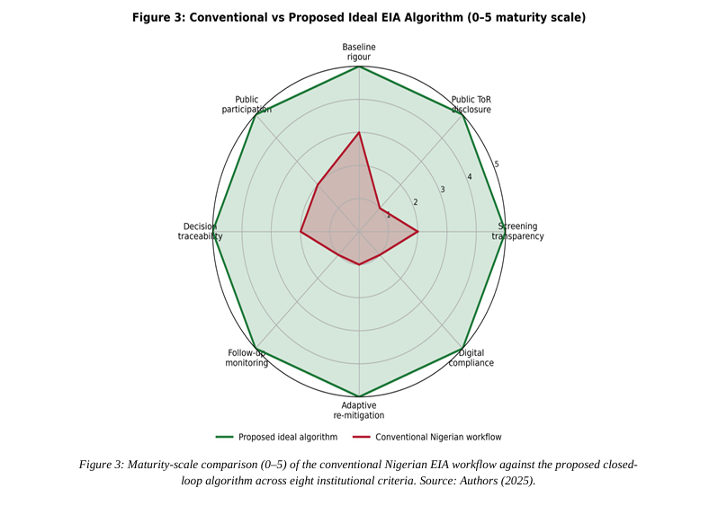

# 🌍 A Review of Environmental Impact Assessment Practice in Nigeria  
### Algorithmic Re-design and Sectoral Audit Using Akwa Ibom State as a Case Study

---

## 📌 Overview
Environmental Impact Assessment (EIA) remains Nigeria’s primary regulatory tool for balancing infrastructure development with environmental sustainability. However, persistent gaps between policy design and real-world compliance continue to limit its effectiveness.

This study delivers a **comprehensive system-level review** of Nigeria’s EIA framework and introduces an **algorithmically redesigned workflow** to improve transparency, accountability, and post-decision monitoring.

## 🖼️ Algorithmic Framework Overview

The proposed 9-stage EIA workflow introduces a structured, feedback-driven system that enhances transparency, enforces compliance checkpoints, and integrates continuous monitoring into Nigeria’s environmental assessment process.

## 🎯 Key Contributions
- 🔍 Systematic review of Nigeria’s EIA legal and procedural framework  
- ⚙️ Design of a **9-stage algorithmic EIA workflow** with feedback loops  
- 📊 Sectoral audit of **50 mandatory-list projects across 17 sectors**  
- 📍 Case study: **Akwa Ibom State**  
- 📉 Identification of compliance gaps in:
  - Screening transparency  
  - Scoping disclosure  
  - Post-approval monitoring  
- 🌱 Policy-aligned recommendations for **SDGs 2030 compliance**

---

## 📊 Key Findings
- Infrastructure & Construction → **18%**  
- Housing → **14%**  
- Petroleum → **10%**  
- Airports & Ports → **2% (lowest representation)**  

---

## 🧠 Proposed Framework
The redesigned EIA model introduces:
- Continuous feedback loops 🔁  
- Mandatory follow-up monitoring 📡  
- Digitally verifiable public participation 🗳️  
- Structured audit checkpoints ✔️  

---

## 📄 Publication
📍 Published on Zenodo  
🔗 Link: (https://doi.org/10.5281/zenodo.19779988)
📌 DOI: [10.5281/zenodo.19779988]

> ⚠️ This repository complements the official publication.  
> Please cite the Zenodo version when referencing this work.

## 📂 Repository Structure
/paper → Published journal paper (PDF)

---

## 🧪 Potential Extensions
This work can be extended into:
- Python-based EIA compliance simulation  
- Dashboard for sectoral environmental risk analysis  
- Policy decision-support systems  

---

## 🏷️ Keywords
EIA, Nigeria, Sustainability, Environmental Policy, Algorithm Design, Regulatory Systems, SDGs

---

## 👤 Author
Otuekong Edet Bassey - Editor
Samuel Edet Bassey - Rights holder
---

## 📜 License
This work is shared in accordance with the terms provided on Zenodo.  
Ensure proper citation using the DOI.

---

## ⭐ Acknowledgment
This research contributes to ongoing efforts to modernize environmental governance in developing economies through structured, data-driven approaches.
---

## 📂 Repository Structure
